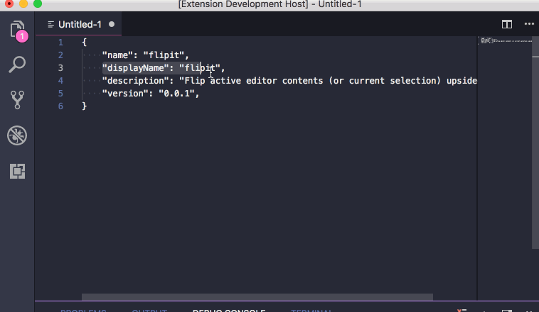
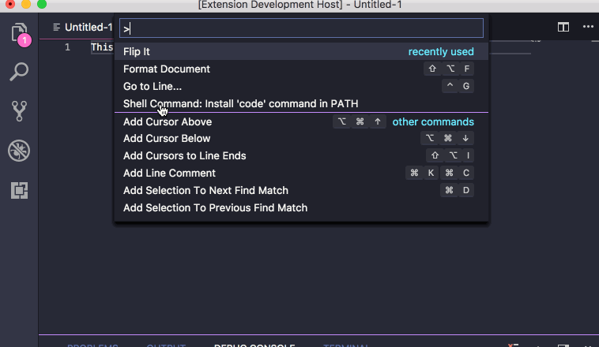

# flipit README

This extension will [flip](https://github.com/jergason/flipjs) the currently selected text or the whole editor if there is no selection and display then output in a new editor.

## Features

Describe specific features of your extension including screenshots of your extension in action. Image paths are relative to this README file.

For example if there is an image subfolder under your extension project workspace:

## Release Notes

### 1.0.0

Initial release of flipit
