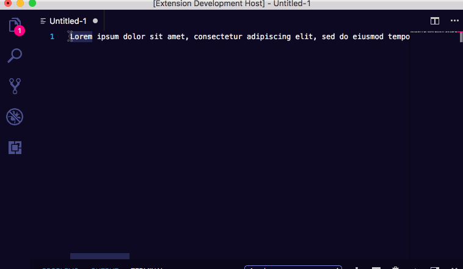
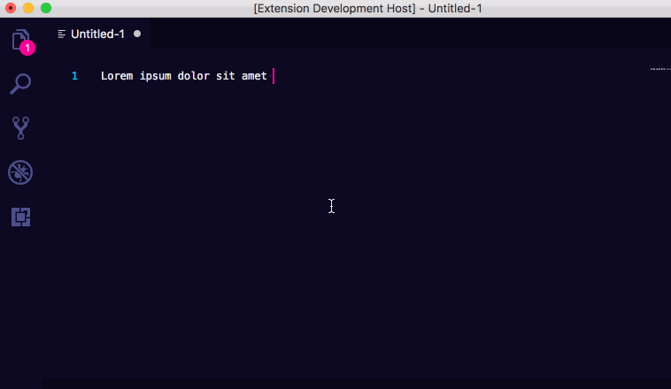

# flipit README

This extension will perform fun transformations on the currently selected text or the whole editor if there is no selection and display the output in a new editor.

Built with the help of:

* [flip](https://github.com/jergason/flipjs)
* [zalgoize](https://github.com/clux/zalgolize)
* [Lunicode](https://github.com/awaigand/Lunicode.js)

## Features

## Release Notes

### 1.0.7

* Update dependencies

### 1.0.6

* Update dependencies

### 1.0.5

* Update dependencies

### 1.0.4

* Update vscode dependency

### 1.0.3

* Added bubble text, mirror text, tiny caps and wonky text transforms

### 1.0.2

* Cleanup disposable
* Update dependencies

### 1.0.1

Add Zalgo support

### 1.0.0

Initial release of flipit
